# Portfolio
**Anwak Manoj Kumar** | Aeronautical Engineering, MIT Manipal  
 

---

## Overview

This repository showcases selected CAD, FEA, and CFD work from my projects at AeroMIT (SAE Collegiate Design Team, MIT Manipal) and personal design work. It is intended to supplement my resume by providing visual evidence of my engineering analysis and modelling capabilities.

My primary CAD tool is **SolidWorks**. I also have hands-on experience with **CATIA** (coursework and lab, MIT Manipal) and **AutoCAD** — models from university computers are not included here as I do not have local copies of those files.

> Full simulation files are not hosted due to ongoing publication restrictions and competition confidentiality.

---

## CAD

SolidWorks models covering competition aircraft, internal structural layouts, and concept designs developed as part of AeroMIT and independent work. Designs span conventional RC aircraft configurations, flying wing concepts, and detailed internal structural assemblies including rib-spar frameworks with carbon fibre reinforcement, designed for manufacturability using laser-cut balsa and carbon fibre composite layups.

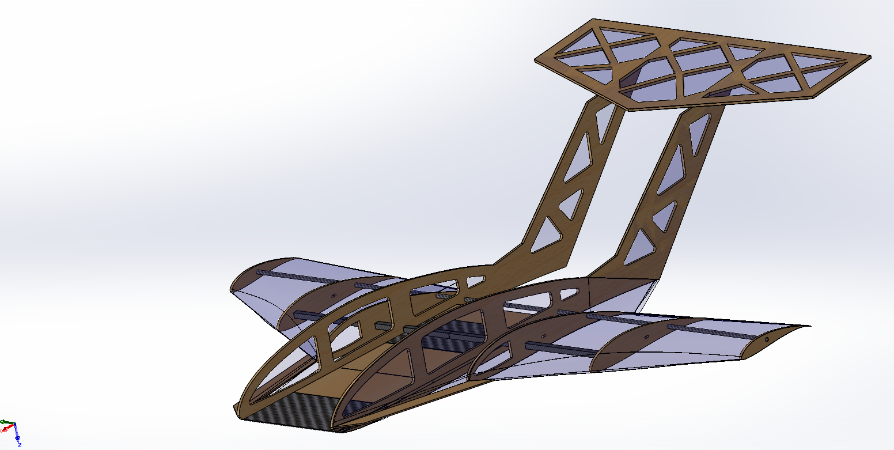
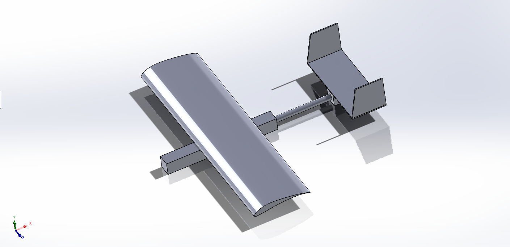
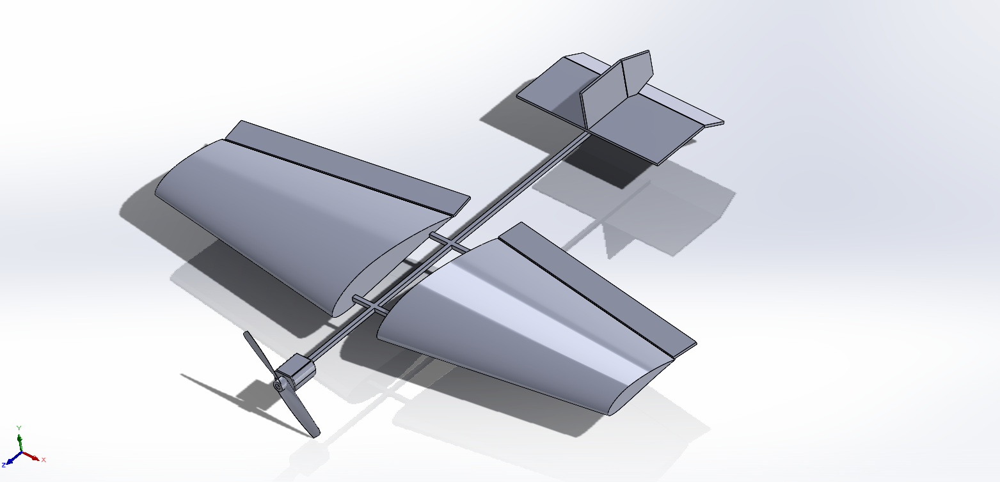
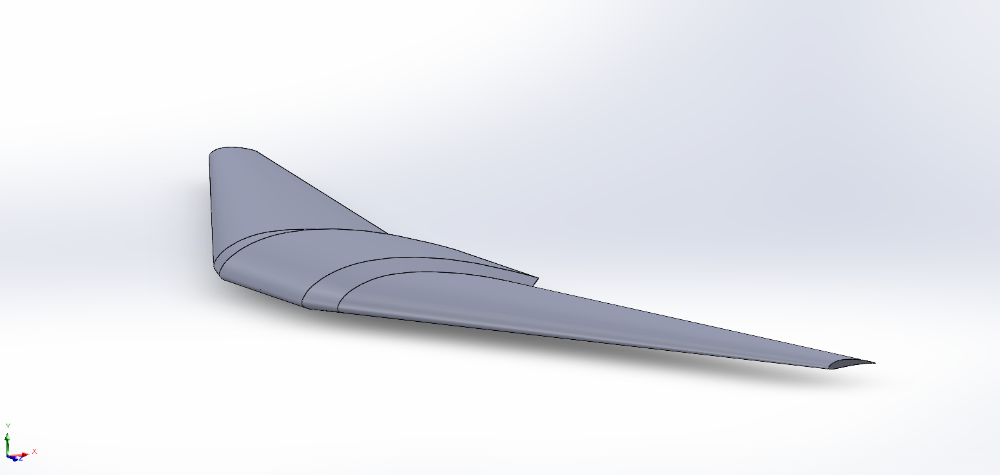
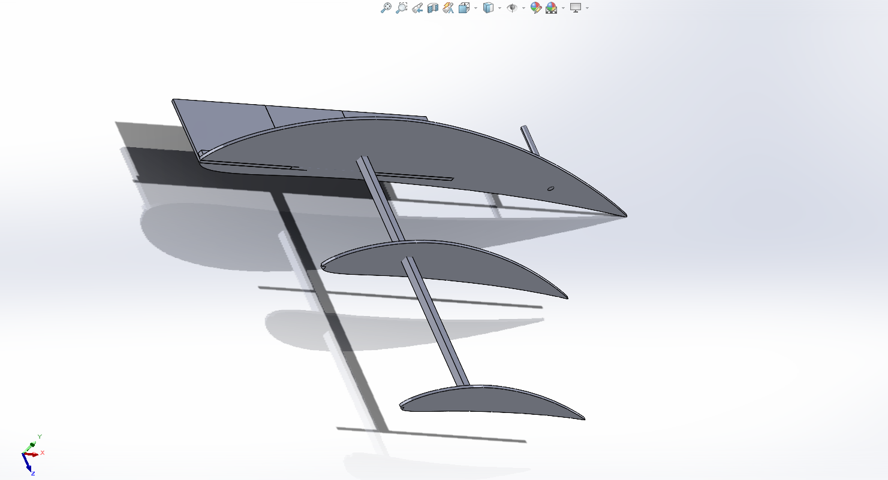
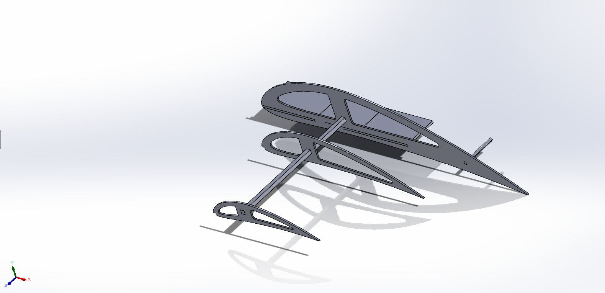

---

## FEA

Structural analyses performed in **ANSYS Mechanical** (Static Structural, Modal, Explicit Dynamics, Random Vibration). Work includes static structural analysis, landing impact simulations, and deformation studies across multiple aircraft components and full airframe assemblies. Analyses were conducted to validate structural integrity against competition load requirements and to drive weight optimisation of key components.

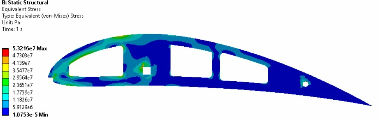
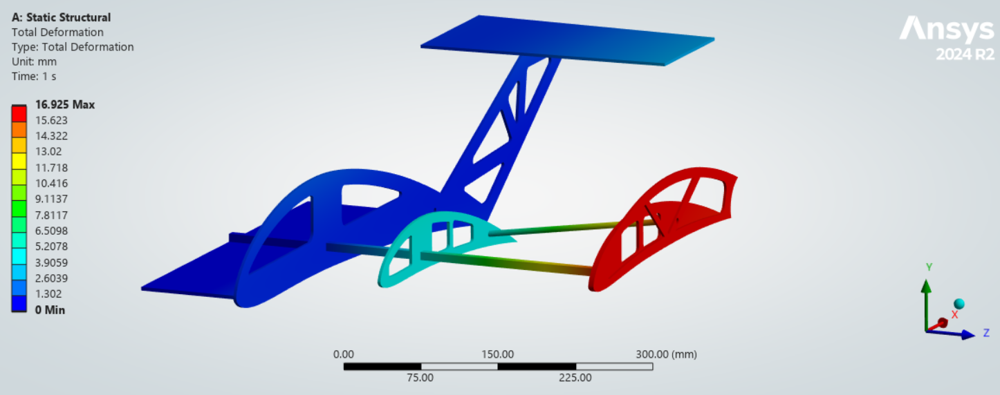
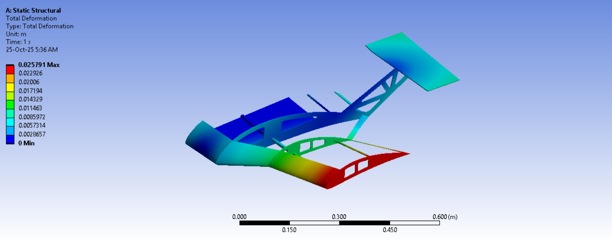
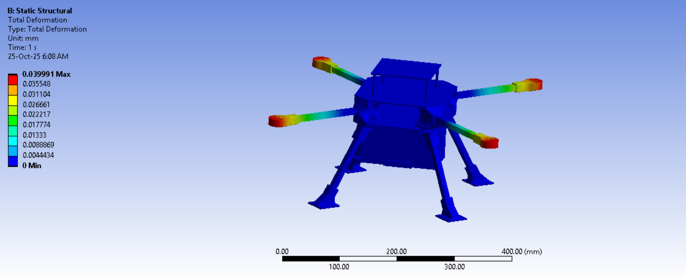

---

## CFD

CFD simulations performed in **ANSYS Fluent**. Work includes 2D airfoil pressure analysis, compressible flow simulations, and full 3D aircraft RANS simulations at competition flight conditions. The 3D pathline results show wake structure, wingtip vortex development, and fuselage flow separation. Additional high-fidelity airfoil CFD work (subsonic, transonic, and supersonic regimes) was carried out using FALCON — see Publications below.

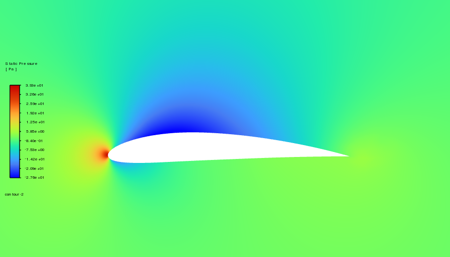
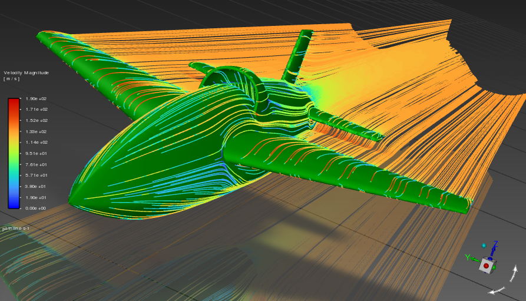
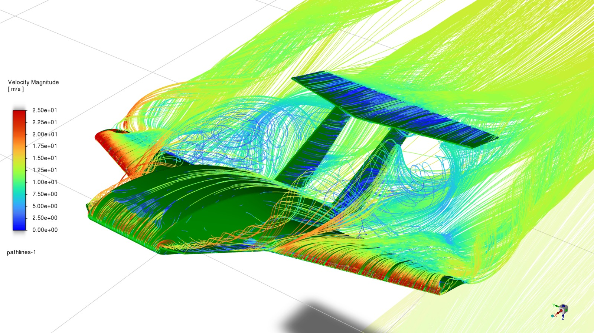

---

## Publications & Software

| Title | Details | Status |
|-------|---------|--------|
| FALCON: Framework for Airfoil CFD and anaLysis OptimizatioN | ICAS 2026, Sydney, Sep 2026 | Accepted — Oral Presentation |
| Advances in Flow–Structure Interaction and Multiphysics Applications: An Immersed Boundary Perspective | *Fluids* (Q2), 2025 — [DOI](https://doi.org/10.3390/fluids10080217) | Published |
| Recent Developments in the Immersed Boundary Method for Complex Fluid–Structure Interactions: A Review | *Fluids* (Q2), 2025 — [DOI](https://doi.org/10.3390/fluids10050134) | Published |

FALCON source code: [github.com/Prisha22/FALCON](https://github.com/Prisha22/FALCON) *(co-developed)*  
Registered Software: SW-47114/2025-CO
